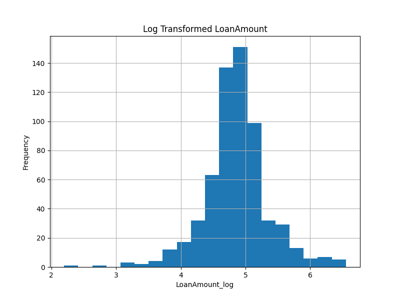
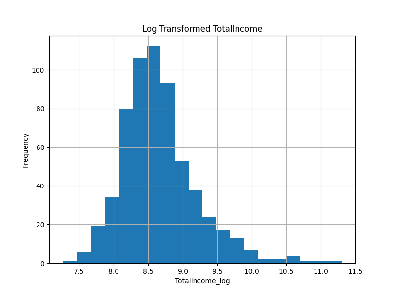
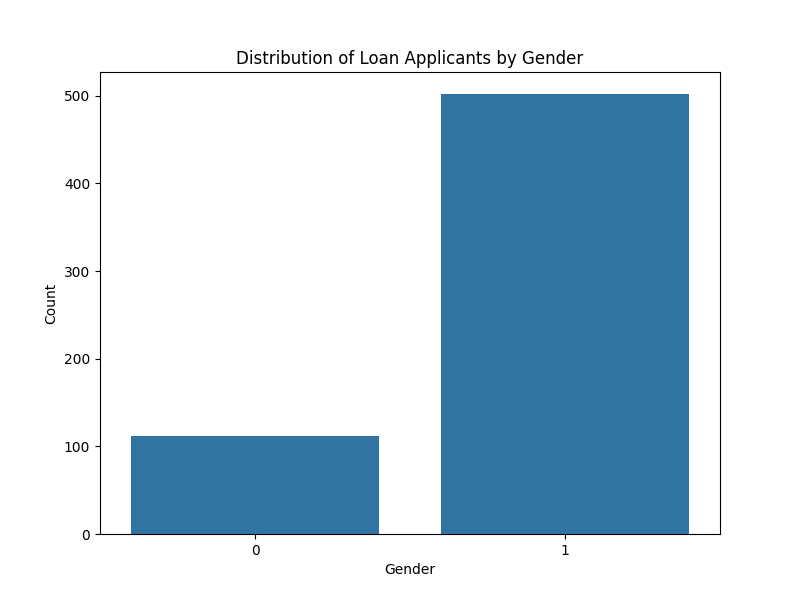
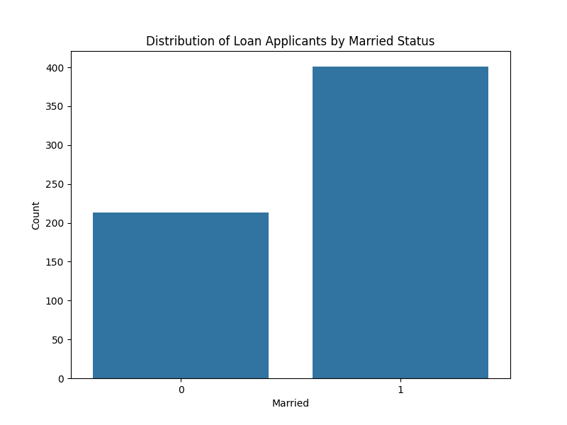
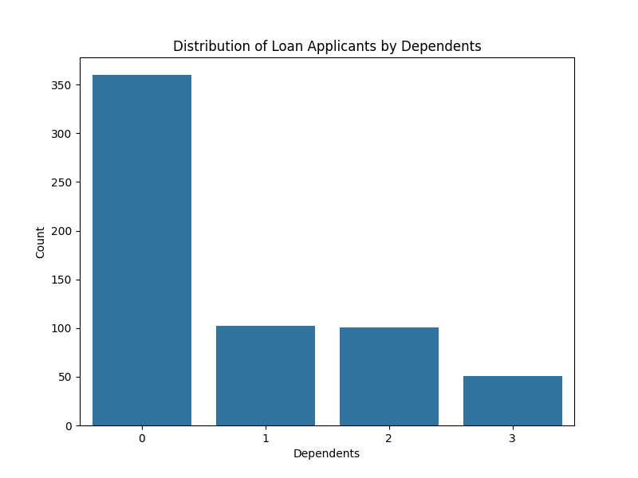
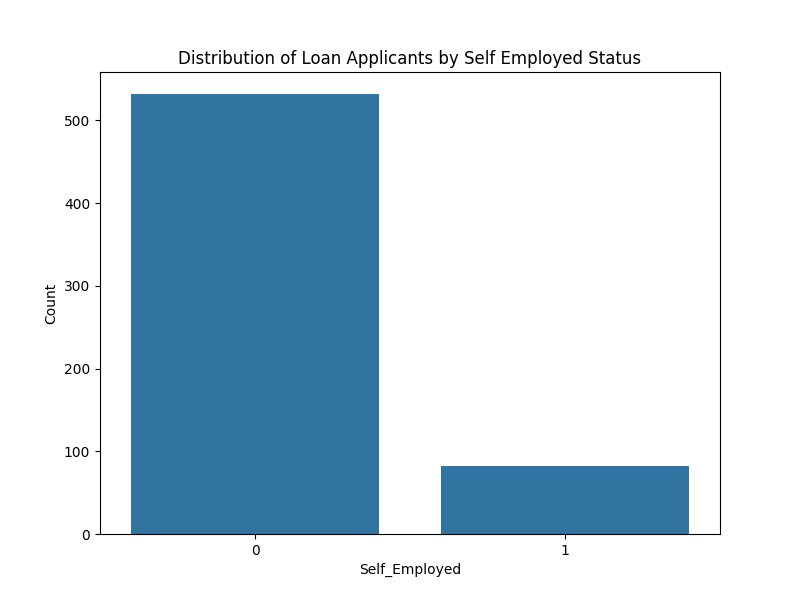
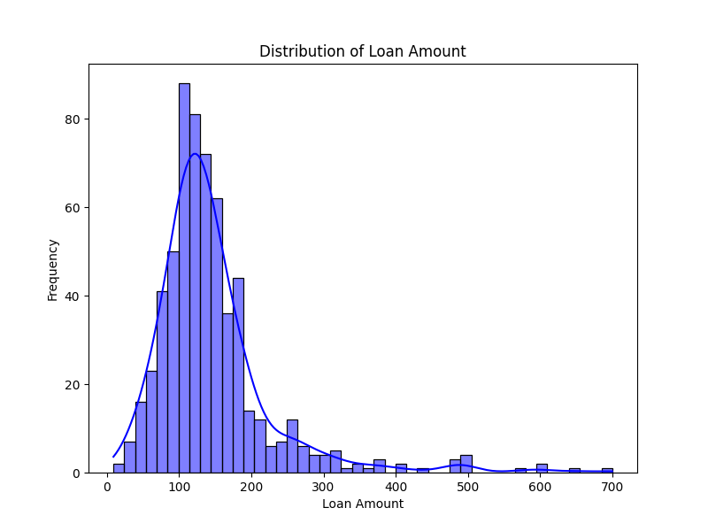
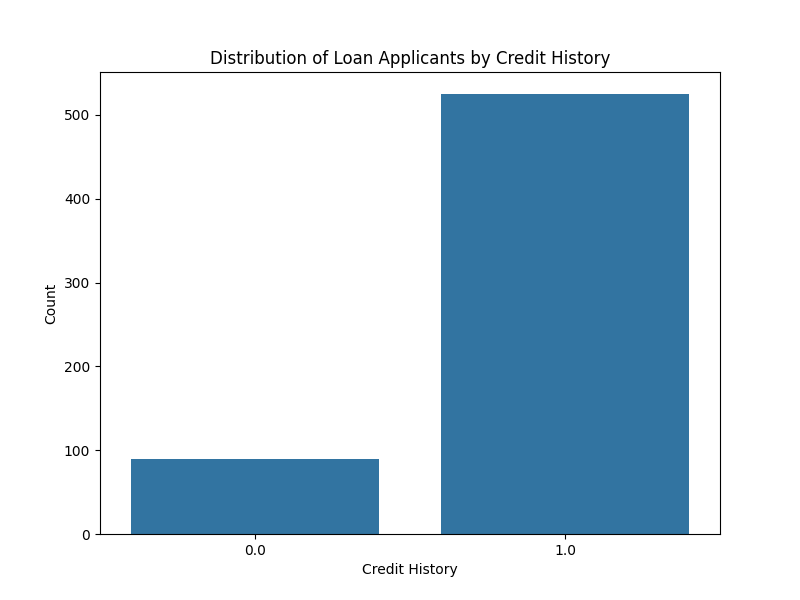
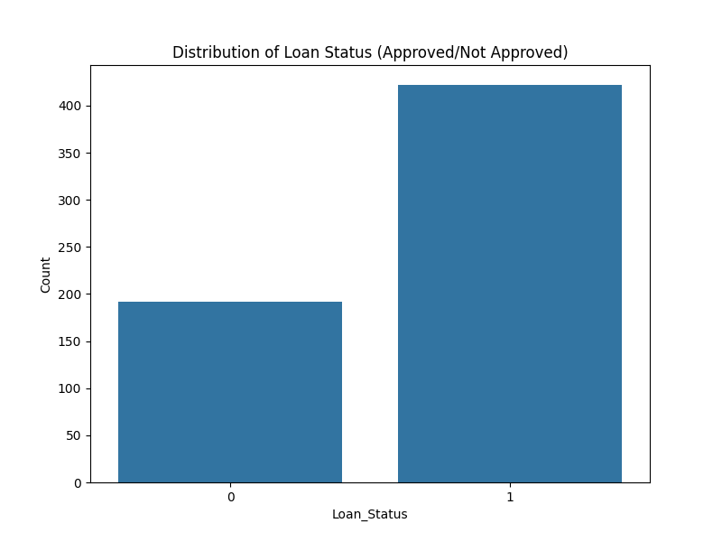

# 🏦 Loan Approval Prediction Project

This project uses a **Random Forest Classifier** to predict whether a loan application will be approved or not based on applicant data such as income, loan amount, credit history, and more. It includes data preprocessing, model training, evaluation, and data visualization.

---

## 📁 Dataset

- The dataset used is a cleaned Excel file: `Copy of loan.xlsx`
- Categorical values are encoded
- Missing values are handled using mean/mode imputation
- Log transformation applied to `LoanAmount` and `TotalIncome` for normalization

---

## 🧠 Machine Learning Model

- **Model:** RandomForestClassifier (from scikit-learn)
- **Evaluation Metric:** Accuracy
- **Accuracy Achieved:** _Shown in the image below_

### 🔍 Terminal Output


---

## 📊 Data Visualization

### 1. Log Transformed Loan Amount


### 2. Log Transformed Total Income


### 3. Gender Distribution


### 4. Married Status Distribution


### 5. Dependents Distribution


### 6. Self Employed Status Distribution


### 7. Loan Amount Distribution


### 8. Credit History Distribution


### 9. Loan Status Distribution



---

## 🛠️ How to Run

1. Clone this repository or download the files.
2. Make sure you have Python installed with the following packages:
   - `pandas`
   - `numpy`
   - `matplotlib`
   - `seaborn`
   - `scikit-learn`
   - `openpyxl` (for reading `.xlsx` files)

3. Install dependencies:
   ```bash
   pip install -r requirements.txt
